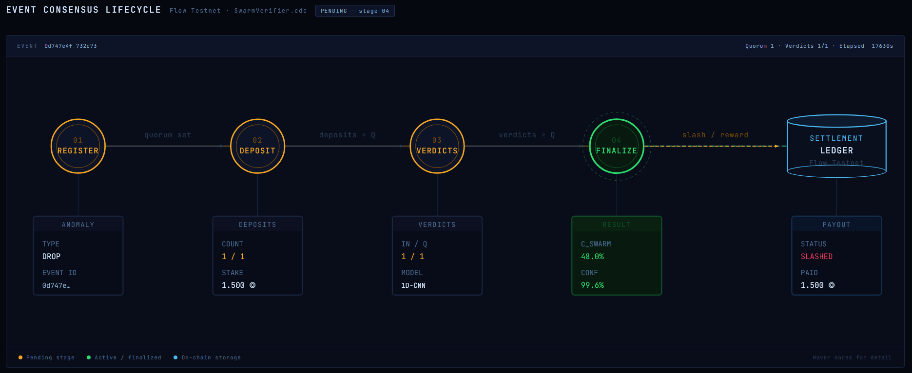
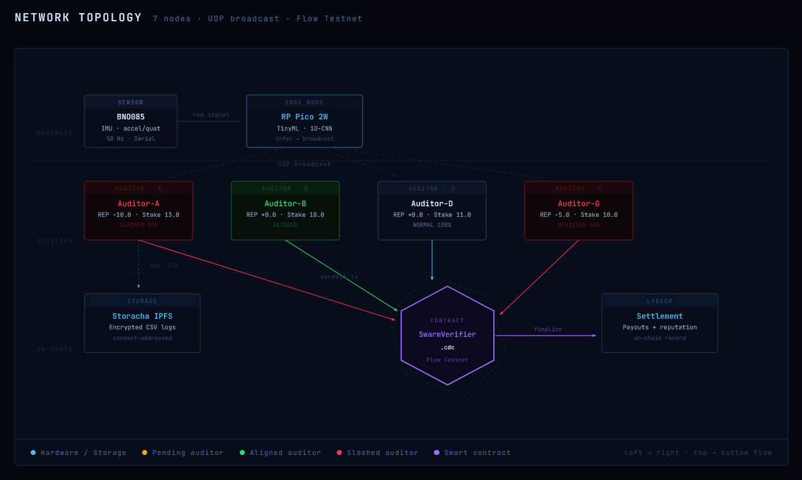
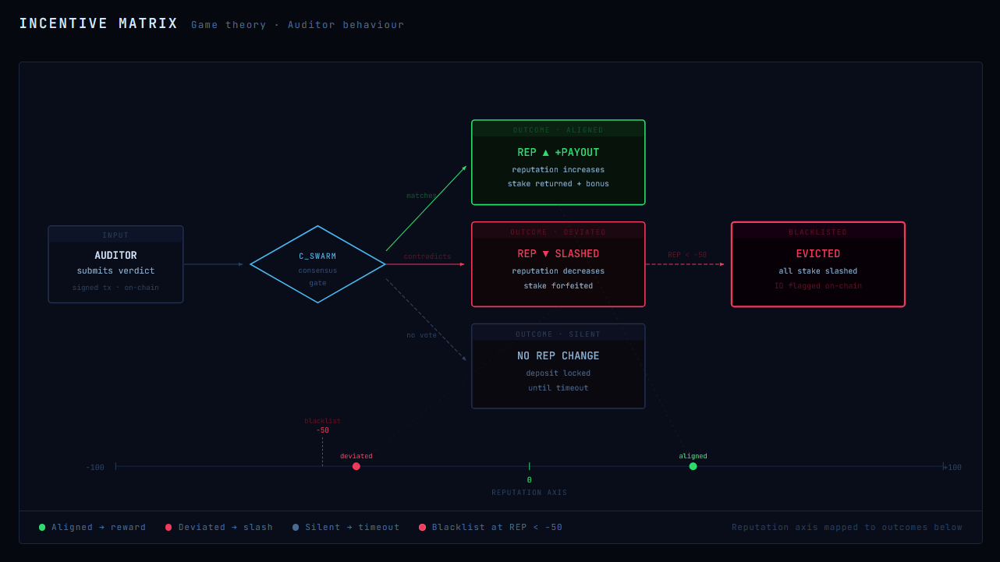

# SENSENSUS
**Zero-Trust IoT Swarms Secured by TinyML, Cryptography, and Web3 Staking.**


## The Problem
In industries spanning supply chain logistics, high-value asset insurance, and remote equipment monitoring, IoT data is traditionally treated as the absolute ground truth. However, hardware sensors represent a massive vulnerability in both traditional systems and modern Web3 architectures. This is known as the "Oracle Problem."

Spoofing an IoT sensor is trivial. If a bad actor physically compromises a single sensor, alters its calibration, or injects fake network packets into the data stream, they can trigger fraudulent insurance claims, hide equipment damage, or disrupt global logistics. Traditional centralized networks blindly trust the data source, creating a massive single point of failure that cannot be solved by software alone.

## The Solution
Sensensus is a complete, end-to-end cyber-physical system built to eliminate blind trust in edge devices. We combine Edge AI (TinyML), Cryptographic Identity, and Web3 Economic Slashing to create a self-policing network of devices (a "swarm").

When a physical node detects an anomaly (such as a severe physical drop or impact), it cannot simply declare this event to the network as fact. It must mathematically prove its claim to a decentralized, staked quorum of peer nodes. If a node is caught lying or hallucinating data, a smart contract automatically slashes its staked funds and permanently damages its on-chain reputation.

### Key Features
* **Zero-Trust Hardware:** Raw sensor data is locally inferred using a 1D Convolutional Neural Network before ever touching the internet.
* **Cryptographic Sybil Resistance:** Every node signs its data beacons using ECDSA (secp256r1) elliptic curves to prevent node spoofing and man-in-the-middle attacks.
* **HTTP 402 Data Tolls:** A unique implementation of the `402 Payment Required` protocol to prevent network spam and monetize hardware data buffering.
* **Immutable Settlement:** Flow blockchain smart contracts handle all consensus logic, economic slashing, and ledger settlements autonomously.

---

## System Architecture & Event Lifecycle

Every detected anomaly undergoes a rigorous 4-stage "Race to Quorum" before being written to the immutable ledger. 


> *Figure 1: The 4-phase lifecycle of an anomaly on the Flow blockchain.*

Our network is divided into two distinct roles: **The Transporter** (the physical asset being tracked) and **The Auditor Swarm** (the decentralized verification network).

### 1. Hardware Detection (Edge AI)
- The **Transporter** (a Raspberry Pi Pico 2 W) samples a high-precision BNO085 IMU (accelerometer and quaternions) at a constant 50Hz.
- An onboard TensorFlow Lite Micro 1D-CNN model continuously runs inference on the data buffer at 1Hz, looking for specific shock signatures.
- If a physical drop is detected with a confidence rating of `>= 0.85`, the node shifts from `STATE_IDLE` to `STATE_ANOMALY`.

### 2. Cryptographic Beacons & Network Topology
Once in an anomaly state, the Transporter must alert the network without relying on a centralized broker. It generates an ECDSA signature of the event timestamp and broadcasts a UDP multicast beacon to the local network. 


> *Figure 2: Data flows from the Hardware Edge, through the Auditor Swarm, and settles On-Chain.*

- Python-based **Auditor nodes** intercept this beacon and verify the public key signature to ensure the Transporter is a registered, staked network participant.
- Auditors submit bids (in Flow tokens) to verify the data. The Transporter selects a quorum based on the Auditors' available stake and their historical reputation scores.

### 3. Verification & The Web3 Bridge
- Selected Auditors pay a dummy **HTTP 402 Payment Required** toll to unlock a 1.5-second CSV buffer of the raw drop data from the Transporter's memory allocation.
- Auditors run the CSV through a secondary, independent Machine Learning model (e.g., a Random Forest classifier via scikit-learn) to mathematically cross-check the hardware's claim.
- The raw data and ML verification logs are encrypted and uploaded to **Storacha** (Filecoin/IPFS) for immutable storage, generating a globally verifiable CID.

### 4. Smart Contract Settlement & Game Theory
Auditors submit their final ML verdict (Drop vs. Normal) to the Flow blockchain via a signed transaction. The `SwarmVerifierV4.cdc` Cadence smart contract waits for the quorum to finish, then executes the Incentive Matrix:


> *Figure 3: The Game Theory and economic incentive matrix governed by SwarmVerifier.cdc.*

- **Aligned Auditors:** If an auditor's verdict matches the Swarm Consensus (`cswarm`), they are rewarded with their deposit back, plus the bid price payout, and a reputation boost.
- **Deviated/Malicious Nodes:** If a node contradicts the mathematical consensus (either due to a faulty ML model or malicious intent), its stake is slashed and its reputation drops. If reputation drops below `-50.0`, the node is permanently blacklisted and evicted from the network.

---

## Security Model

Sensensus is designed to withstand several attack vectors common to IoT networks:

1. **Hardware Tampering / Spoofing:** If an attacker hits a sensor with a hammer to simulate a drop, the raw IMU data signature will differ from a true free-fall impact. The Auditor Swarm's independent ML models will flag the data as anomalous and slash the Transporter.
2. **Sybil Attacks:** An attacker cannot spin up thousands of fake Transporters or Auditors. Every node must be registered on the Flow blockchain with an active financial stake.
3. **Network Spam / DDoS:** Transporters protect their limited memory buffers by requiring an HTTP 402 payment before releasing data, making DDoS attacks financially unviable.

---

## Tech Stack

**Edge Hardware & Firmware**
* Raspberry Pi Pico 2W (RP2350)
* BNO085 9-DOF IMU (I2C/Serial)
* C++ / PlatformIO
* lwIP UDP Multicast & HTTP Server

**Machine Learning**
* TensorFlow Lite Micro (C++ execution on Edge)
* scikit-learn (Python execution on Auditor Nodes)
* 1D Convolutional Neural Networks & Random Forest Classifiers

**Blockchain & Storage**
* Flow Testnet
* Cadence Smart Contracts (`SwarmVerifierV4.cdc`)
* Storacha (IPFS CID generation for immutable data proofs)

**Frontend Dashboard**
* React.js + Vite
* Custom CSS (Zero-Trust Mission Control UI)
* Flow FCL (Flow Client Library)

---

## Getting Started

### Prerequisites
* PlatformIO installed via VSCode.
* Flow CLI installed on your host machine.
* Node.js v18+ and npm.
* Python 3.9+ with `scikit-learn` and `requests` installed.

### 1. Flash the Hardware
Navigate to the `PICOPART` directory. Open your configuration file to define your local Wi-Fi credentials and flash the firmware to your Pico 2W.
```bash
cd PICOPART
pio run --target upload
```
### 2. Deploy Flow Smart Contract

Deploy the staking and consensus logic to the Flow testnet. Ensure your `flow.json` is configured with a valid testnet account.

```bash
flow project deploy --network testnet
```

### 3. Spin up the Dashboard

Start the React frontend to visualize network consensus, reputation, and slashing events in real-time.


```bash
cd dashboard
npm install
npm run dev
```

### 4. Run the Python Auditors & Trigger an Event

Start your auditor nodes in separate terminal windows to simulate the decentralized swarm.


```bash
cd auditors
python auditor_node.py --id Auditor-A
python auditor_node.py --id Auditor-B
```

Once the network is live, physically drop the hardware. Watch the React Dashboard visualize the network consensus, intercept the UDP packets, process the x402 payment, and trigger the Flow slashing event in real-time.
